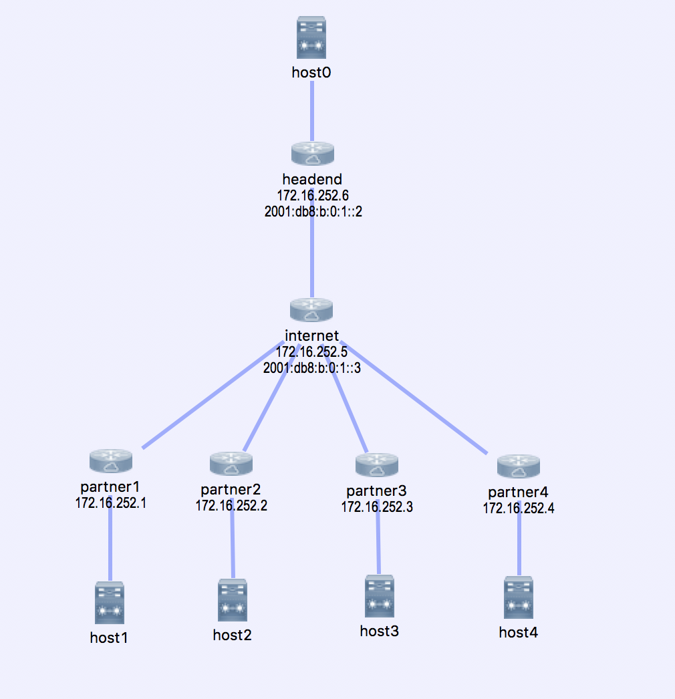

# ansible-vpn

A demonstration ansible playbook for managing VPN connections.

## Topology

For convenience, we've provided a `topology.virl` file which provides test topology.




## Configuration

You will likely need to modify the IP addresses in the `topology.virl` file as well as `inventory.yml`


## Authentication

Make sure you set your ansible credentials in your current environment. This repo provides a sample in [ansible.env.sample](./ansible.env.sample) copy this file to `ansible.env` and update it with your credentials.


Simply modify this with your credentials, and then run:
```
source ansible.env
```

## Running the playbook locally

Create virtualenv and install dependencies
```
virtualenv venv
source venv/bin/activate
pip install -r requirements.txt
```

Run the playbook

```
ansible-playbook -i inventory.yml site.yml
```

## Running the playbook using docker

If you have docker installed, you can simply build a container to deploy your playbook.

**NOTE:** you still need to source your credentials as shown above, or inject them into the container through some other method (VCS, PaaS)

```
docker build -t vpn-deployer .
docker run --rm \
-e ANSIBLE_NET_USERNAME \
-e ANSIBLE_NET_PASSWORD \
-e ANSIBLE_NET_AUTH_PASS \
-e ANSIBLE_NET_AUTH \
vpn-deployer
```
